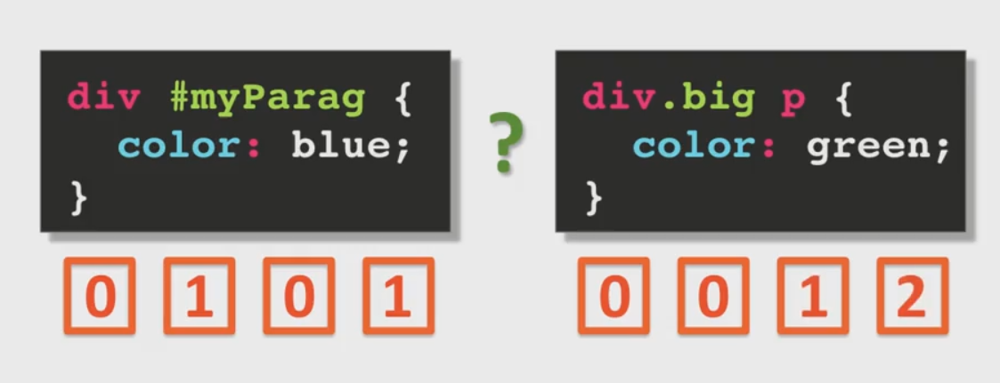

# CSS3要点记录

### Style Placement
最好的方法是采用外部文件的方式。 override的优先级为`inline style > head style > external style`。

### Cascading Algorithm

#### 原始优先级
最后声明的生效。因为HTML文档是由上至下按顺序解析的。对于外部CSS，他的位置就是在它申明的地方即head部分。所以不难理解为什么它的优先级最低了。

#### 声明合并。
如果不同位置的CSS他们之间没有冲突，那么他们所定义的属性会同时生效，这点非常自然。

#### 继承
父元素中定义的属性，在子元素和子孙元素中都会得到继承（有些特殊的属性不会被继承如`box-sizing`）。子孙元素具体应用的属性要靠不同的优先级决定。

#### 具体化
最具体的选择器组合优先。问题是如何判断哪个选择器更具体。

如上图所示四个空格连起来表示一个四位数字，例如`<h2 style="color: blue;">`千位置1，得到1000分，这也是最高的分数了。再如`div p { color: green;}`用到的2个elment所以值为2。

可以在属性值后面加上`div p { color: green !important;}`无视所有分数。但这毫无疑问会带来维护上的问题，所以`!important`是不推荐使用的。

#### 文字样式
`text-transform`属性可以调整文本的大小写，对中文来说没什么用：）
`font-size`属性中除了可以写绝对像素值意外还可以写`%`和`em`, 这两种都是表示倍数，`font-size: 120%`表示默认文字大小的1.2倍，浏览器默认的文本大小是16px，如果加上这个样式的话，文本大小就会变为16*1.2=19.2px，`em`通常用来表示整数倍的文本大小，如`2em`表示2倍于当前的文字大小。`%`和`em`都表示一种相对大小，所以它们互相之间不会override，而是会叠加。
`font-size`还有一种`vm`单位，`1vw = 1% of viewport width`,适用于响应式设计，文字的大小会随着屏幕的大小变化而变化。

### 盒子模型
CSS3中提倡使用`box-sizing: border-box`, 这样设置后，在盒子里面设置width和height值将会是盒子的确切大小。默认的`box-sizing`是`content-box`正如名字的意思一样，`content-box`里面设置width和height是盒子模型中的content的大小，盒子的实际大小还需要加上padding和border宽度。
`box-sizing`是一个无法被继承的属性。
margin左右会相加，上下取大的margin。也不知道为什么会有这样的规定。
使用`box-sizing: border-box`后，如果只设置盒子的宽度，盒子里的内容超出了盒子的宽度，那么盒子会自己增加高度来显示盒子的内容。但是如果高度也是固定值，那么盒子的内容就会溢出，可以通过`overflow`属性来控制溢出的处理方法。

### 浮动
为了满足更加丰富的网页布局设计，CSS提供了浮动的功能。

对于清除浮动的解释，例如你现在看到的一个网页上的某个部件，因为它左右的元素浮动导致它的出现在了它不该在的位置，如果这个时候给它加上`clear: both;`这条属性，则它将假定它左右的元素都是不浮动的，即处于标准文档流中，这时它再计算自己的位置。注意`clear`的作用不是让别的元素不浮动，而是让自己假设别的元素不浮动的情况下，计算自己的位置。（如果有新的理解，以后再修改。）