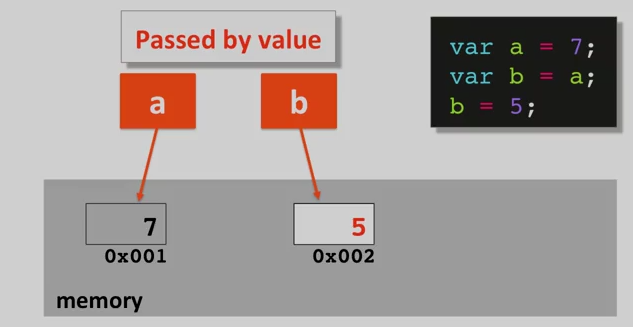
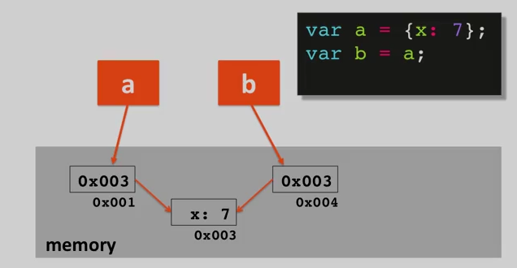

# Javascript Fundamentals

### javascript代码放在哪里 

* inside `head` section or `body` section.
``` <script> </script>```
* inside an external file.
``` <script src="js/script.js"> <script>```

Javascript代码是从上到下顺序执行的，并且浏览器中javascript引擎是一个单线程的引擎，javascript代码一旦执行，就会一次性执行完。

```html
<!-- html code -->
<!doctype html>
<html lang="en">
  <head>
    <meta charset="utf-8">
    <script>
    console.log(x);
    </script>
  </head>
<body>
  <h1>Lecture 40</h1>

  <script src="js/script.js"></script>
  <script>
  console.log("after hello world!");
  </script>
</body>
</html>
```

```javascript
// javascript code
var x = "hello, world!";
```

控制台输出: 
```
hello, world!
after hello world!
```

### Javascript 函数和作用域
javascript中函数的参数都是可选的。

```javascript
function compare(x, y) {}
var a = compare(4, 5);
compare(4, 'a');
compare();
compare(3, 4, 5); //the third arguments is not used in the function, but it's perfectly legal to pass it in.
```

上面代码中的用法都是合法的。

Javascript中只有两种作用域，Global和Function(aka lexical)。定义在全局下的变量或函数可以在任何地方执行，而定义在函数中的变量或**函数**只能在函数内部使用。

#### Javascript作用域链

* Javacript代码都是在一个Execution Context中执行
* 函数调用会创建一个新的Execution Context
* 每个Execution Context拥有：
    - 独有的变量环境
    - 特殊的`this`对象
    - 对__外部环境__的引用
* 全局作用域没有外部环境，因为它本身就是处在最外部的。

Javascript作用域链的工作原理：
被引用（不是定义）的变量首先会在自己所处的作用域中搜索。如果没有找到，就会向它的外部引用（外部环境的引用），如果仍没找到，那么就会向它的外部引用的外部引用去搜索，直到搜索至全局作用域。如果全局作用域中没找到，那么该变量就是未定义的（undefined）。

```javascript
// Global
var x = 2;
A();

function A() {
  var x = 5;
  B();
}

function B() {
  console.log(x);
}
```

上面代码的输出结果是2而不是5。因为函数B是在全局作用域中__定义__的，所以它的外部引用是全局作用域。x会首先函数B中搜索，发现没找到后，就开始在它的外部作用域中搜索，而它的外部作用域是全局作用域而不是函数A作用域。

无论一个函数是在何处__执行__，就处理变量作用域而言，只和该函数物理上被定义所处的环境有关。

### Javascript built-in Types
Javascript中有7中built-in类型：其中6种是原始类型，一种是对象类型。

Javascript中的对象就是一组__键值对__。

```javascript
person = {
  firstname: "Sy",
  lastname: "Ling",
  contact: {
    tel: 10000000,
    email: "somebody@xxmail.com"
  }
}
```

Javascript中的原始类型用于表示__单一__，不可变的值。

* `Boolean` 只用两种值：true和false。
* `undefined` 声明但从未被设值的变量。变量在内存中的位置已经确定，但是没有设定值。只有一种值：undefined。你可以个一个变量赋值为undefined，但是你最好永远不要这样做。
    - 和他的本意矛盾。
    - `undefined / 5`的值为`NaN`。
* `null` 表示没有值。只有一种值：null。你可以给一个变量赋值为null。
* `number` javascript中唯一的数值类型。实际是一个双精度64位浮点类型。
* `string` 用来表示一串字符。
* `symbol` ES6中的新内容。

#### Type Coercion
使用双等号`==`来比较两个变量的时候，javascript会做自动的类型转换。

使用`===`表示严格等于，javascript首先会比较两个变量的类型，如果类型不一样，就不会继续比较他们的值而直接返回false。

javascript中会被强制转换为false的一些情况如下代码所示。

```javascript
if ( false || null || undefined || "" || 0 || NaN ) {
  console.log("This line won't ever execute.");
}
else {
  console.log("All false.");
}
```

也可以使用`Boolean(undefined)`来查看不同类型强制转换为布尔类型后的结果。

Javascript中不要将`{`放在单独一行。

Javascript中`"" || "hello"`将返回"hello"而不是true，也就是说这个表达式在进行type coercion之前就返回值了。使用`Boolean("" || "hello")`，才会返回true。


### Javascript Object
#### 创建对象
使用`new Object()`创建对象：
```javascript
var company = new Object();
// 自动创建属性
company.name = "Facebook";
company.ceo = new Object();
company.ceo.firstName = "Mark";
company.ceo.favColor = "blue";
// Note that you can not use dot notation here.
// 只有当属性名为合法的javascript变量名的时候才可以使用dot notation.
company["stock of company"] = 110;
```

使用Object literal创建对象：
```javascript
var facebook = {
  name: "Facebook",
  ceo: {
    firstName: "Mark",
    favColor: "blue"
  },
  // 属性加不加双引号都是字符串
  "stock of company": 110
}
```

使用上述两种方法创建的对象的结果是一样的，但明显使用Object literal要更加直观。

#### Function
在javascript中function属于'First-Class Data Types'，意思是你能对一个变量或者对象进行的操作都可以对函数进行。

Javascript中函数只是regular Object，但是有一些特殊的属性。

```javascript
function multiply(x, y) {
  return x * y;
}
console.log(multiply(5, 3));
// you can add property to a function
multiply.version = "v.1.0.0"

// function factory
function makeMultiplier(multiplier) {
  var myFunc = function (x) {
    return multiplier * x;
  }
  return myFunc;
}

var multiplyBy3 = makeMultiplier(3);
var multiplyBy5 = makeMultiplier(5);

// 将函数作为参数传递
function doOperationOn(x, operation) {
  return operation(x);
}

var result = doOperationOn(5, multiplyBy3);
```

### 按值传递 & 按引用传递
Javascript中原始类型是按值传递的，对象类型按引用传递。但是从实现原理上理解，它们实际上都是按值传递的。举例如下：
```javascript
var a = 7;
var b = a;
```


```
var a = {x:7};
var b = a;
```


图中可以清晰的看出原始类型和对象类型在内存中的区别，原始类型的变量在内存中存储的是实际的值，而对象类型在内存中存储的却是另一个内存地址（用来存储对象数据）。

### prototype
引子：
```javascript
// function constructors
function Circle(radius) {
  this.radius = radius;

  this.getArea = function () {
    return Math.PI * Math.pow(this.radius, 2);
  };
}

var myCircle = new Circle(10);
```
使用上述方法创建的函数对象，每创建一次函数对象内的属性radius和getArea函数都会被创建一次，对于radius来说多次创建是合理的，但是对于getArea函数，只需要创建一次就可以，所有Circle的示例共享该函数。
```javascript
// function constructors
function Circle(radius) {
  this.radius = radius;
}

Circle.prototype.getArea = function () {
  return Math.PI * Math.pow(this.radius, 2);
}

var myCircle = new Circle(10);
```
使用这种方法来创建函数构造器就和其他语言中的类非常类似。

### DOM操作
window 
document
document instanceof HTMLDocument
textContent
innerHTML
document.querySelector

### Ajax
Ajax的原理和事件相应类似，JS代码是一行一行执行的，如果中间有一行代码使用的Ajax请求，JS引擎会将这个请求和相应的JS处理函数地址发送给HTTP Requestor（负责处理HTTP请求的组件），JS会继续向下执行，不会等待HTTP响应。在某一时刻，JS代码可能已经全部执行完，这时收到服务器的响应，JS引擎会根据处理函数地址去执行响应动作。